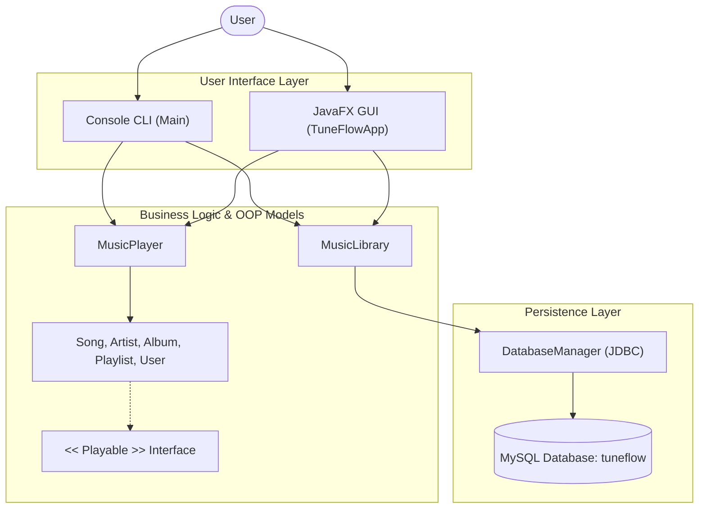
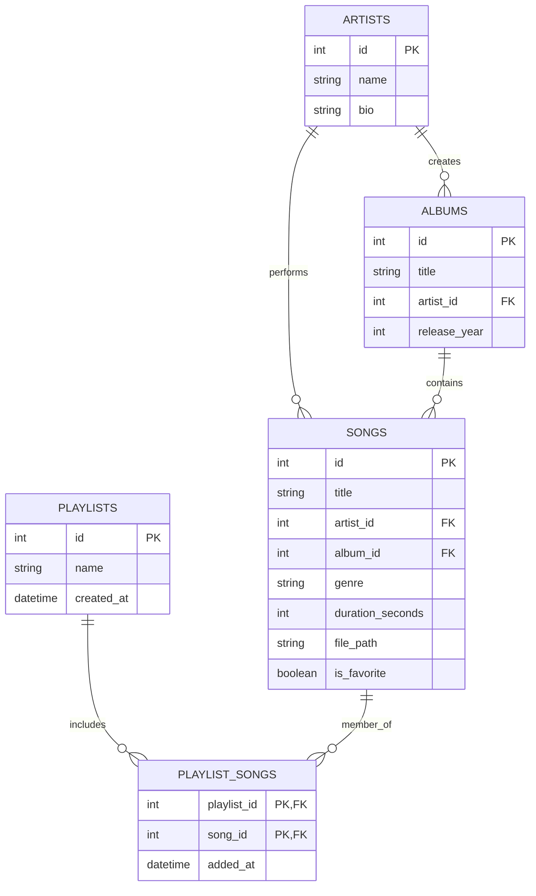

# 🎵 TuneFlow: A Personal Music Library and Playlist System
## An Object-Oriented Music Management and Playback Application with JavaFX & MySQL

---

### 1. Abstract

The mini-project **“TuneFlow”** (Personal Music System) is designed to provide users with a modern, elegant, and modular platform to organize and manage their personal music collection. The system allows users to store songs, artists, albums, and playlists, search for songs across multiple metadata fields, curate custom playlists, mark favorite tracks, and experience simulated or real local audio playback.

The application is developed using **Java** adhering strictly to **Object-Oriented Programming (OOP)** concepts, with **JavaFX** for the desktop graphical user interface and **MySQL** for robust relational persistence. Different classes represent songs, artists, albums, playlists, users, the music player, and database access. The project demonstrates core OOP principles including encapsulation, inheritance, abstraction, interfaces, polymorphism, and composition.

**Keywords:** Java, Object-Oriented Programming, JavaFX, MySQL, JDBC, Music Player, Playlist, Audio Management.

---

### 2. Introduction

#### 2.1 Overview of Personal Music Systems
Modern digital streaming and audio library applications allow users to organize and access large music collections efficiently. A personal music system provides core audio management functionality while giving the user direct ownership and control over their music library, offline tracks, and curated playlists.

TuneFlow allows users to:
- View all available songs in the database.
- Search songs by title, artist, album, or genre.
- View categorized artists and discographies.
- Create and organize personalized playlists.
- Add and remove tracks from playlists.
- Mark and manage favorite tracks.
- Control audio playback with play, pause, seek, volume, next, and previous functions.
- Persist all changes to a MySQL relational database.

#### 2.2 Purpose and Scope
The primary purpose of the project is to develop an extensible music management system while applying Java OOP concepts in a real-world scenario.

The prototype encompasses:
- Music library management with full database persistence.
- Song, artist, and album organization.
- Playlist creation and track assignment.
- Multi-attribute song search.
- Favorites management.
- Real and simulated audio playback with JavaFX MediaPlayer.

#### 2.3 Application of Object-Oriented Programming
Real-world audio entities are modeled as cohesive Java objects:
- `Media` (Abstract Base Class)
- `Song` (Concrete Child Class)
- `Playable` (Interface)
- `Artist`
- `Album`
- `Playlist`
- `User`
- `MusicPlayer`
- `MusicLibrary`
- `DatabaseManager`

#### 2.4 Future Scalability
The architecture is structured to support:
- Cloud-based audio streaming and Spotify/YouTube API integration.
- Intelligent music recommendations using collaborative filtering.
- Audio equalizer and waveform visualizers.
- Multiple user profiles with authentication and access control.
- Listening history and listening statistics (most-played songs/artists).

---

### 3. Requirement Specification

#### 3.1 Software Requirements
- **Programming Language:** Java (JDK 17 or higher; tested on JDK 25 LTS)
- **GUI Framework:** JavaFX 23 (OpenJFX SDK)
- **Database:** MySQL Server 8.0+ / MariaDB (via XAMPP or standalone)
- **JDBC Driver:** MySQL Connector/J 8.4.0
- **Operating System:** Windows 10/11, Linux, or macOS

#### 3.2 Hardware Requirements
- **Processor:** Intel Core i3 or equivalent
- **RAM:** Minimum 4 GB (8 GB recommended)
- **Storage:** Minimum 500 MB free space
- **Audio:** Standard sound output device (Speakers / Headphones)

---

### 4. Architectural Structure & Design

#### 4.1 System Architecture
TuneFlow follows a 3-tier modular architecture:
1. **Presentation Layer:**
   - JavaFX Desktop GUI (`TuneFlowApp.java`)
   - Interactive Console CLI (`Main.java`)
   - Standalone Web Prototype (`index.html`)
2. **Business Logic & OOP Layer:**
   - `MusicLibrary.java` (Catalog orchestration)
   - `MusicPlayer.java` (Audio playback & queue management)
   - Domain Entities: `Song`, `Artist`, `Album`, `Playlist`, `User`
3. **Data Access Layer:**
   - `DatabaseManager.java` (JDBC connection, DAO methods)
   - MySQL Database (`tuneflow`)



#### 4.2 Database Relational Schema (ER Diagram)



---

### 5. Module Description

#### 5.1 User Interface Module
- **Console CLI (`Main.java`):** Implements a clean 7-option menu matching user requirements (View songs, Search, Create playlist, Add to playlist, View playlist, Play song, Exit).
- **JavaFX Desktop App (`TuneFlowApp.java`):** A modern dark-mode GUI with neon cyan/purple glassmorphic styling, responsive sidebar, real-time search filtering, dynamic views (Home, Library, Artists, Albums, Favorites, Playlists), and modal dialogs for adding music and managing playlists.

#### 5.2 Music Library Module (`MusicLibrary.java`)
- Acts as the central facade connecting domain logic to the persistence layer.
- Handles querying, searching, filtering, adding songs, and retrieving artist/album catalogs.

#### 5.3 Playlist Module (`Playlist.java`)
- Models custom user playlists containing zero or more `Song` objects (Composition).
- Calculates total runtime, track count, and formatted output.

#### 5.4 Music Player Module (`MusicPlayer.java`)
- Implements audio state machine (`PLAYING`, `PAUSED`, `STOPPED`).
- Supports playback of local MP3/WAV files using JavaFX `MediaPlayer`.
- Uses a non-blocking background scheduler (`ScheduledExecutorService`) for simulated playback when no audio file is attached.
- Exposes `PlaybackListener` callbacks to update UI sliders, elapsed time, and button icons.

#### 5.5 Database Persistence Module (`DatabaseManager.java`)
- Manages MySQL JDBC connection pooling (`jdbc:mysql://localhost:3306/tuneflow`).
- Auto-creates database schema if missing.
- Pre-seeds initial sample tracks, artists, and playlists if the library is empty.
- Performs parameterized SQL queries preventing SQL injection.

---

### 6. Implementation & OOP Principles

| OOP Concept | Project Application | Code Demonstration |
| :--- | :--- | :--- |
| **Encapsulation** | Private instance variables with public getters/setters in `Song`, `Artist`, `Album`, `Playlist`, and `User`. | `private String title; public String getTitle() { return title; }` |
| **Abstraction** | `Media.java` defines abstract method `displayDetails()`, hiding low-level details. | `public abstract class Media implements Playable` |
| **Inheritance** | `Song` inherits core attributes (`id`, `title`, `durationSeconds`) from `Media`. | `public class Song extends Media` |
| **Interfaces** | `Playable.java` defines standard audio playback operations (`play`, `pause`, `stop`, `isPlaying`). | `public interface Playable` |
| **Polymorphism** | `Song` implements polymorphic playback methods defined in `Playable`. Subclasses of `Media` implement custom `displayDetails()`. | `@Override public void play() { ... }` |
| **Composition** | `Playlist` has a collection of `Song` objects (`List<Song> songs`). `Artist` has a list of songs. | `private List<Song> songs = new ArrayList<>();` |

---

### 7. Source Code Structure

```text
Personal Music System/
├── bin/                       # Compiled Java .class bytecode
├── javafx-sdk-23.0.1/         # OpenJFX 23.0.1 runtime libraries
├── lib/
│   └── mysql-connector-j-8.4.0.jar  # MySQL JDBC Driver
├── src/
│   ├── Album.java             # Album model
│   ├── Artist.java            # Artist model
│   ├── DatabaseManager.java   # MySQL JDBC DAO & schema migration
│   ├── Main.java              # Interactive Console CLI (7 menu options)
│   ├── Media.java             # Abstract media class (Abstraction/Inheritance)
│   ├── MusicLibrary.java      # Library service coordinator
│   ├── MusicPlayer.java       # Audio player & state machine
│   ├── Playable.java          # Playback interface
│   ├── Playlist.java          # Playlist model (Composition)
│   ├── Song.java              # Song model (Encapsulation/Inheritance)
│   ├── TuneFlowApp.java       # JavaFX GUI Desktop Application
│   └── User.java              # User model
├── schema.sql                 # MySQL schema creation script
├── compile.bat                # Windows 1-click compilation script
├── run-console.bat            # Windows 1-click Console CLI launcher
├── run-gui.bat                # Windows 1-click JavaFX GUI launcher
├── index.html                 # Companion web interface prototype
└── PROJECT_REPORT.md          # Comprehensive project report
```

---

### 8. Verification & Execution Results

#### 8.1 Compilation
Executed via `compile.bat`:
```cmd
javac -d bin --module-path "javafx-sdk-23.0.1\lib" --add-modules javafx.controls,javafx.media,javafx.fxml -cp "lib\*" src\*.java
```
Result: **Zero errors, 14 class files generated.**

#### 8.2 MySQL Persistence Verification
```sql
USE tuneflow;
SELECT id, title, genre FROM songs;
-- Result: 8 seeded tracks with artists and albums

SELECT id, name FROM playlists;
-- Result: Playlists persisted and updated dynamically
```

#### 8.3 Console CLI Menu Execution
```text
===========================================
               TUNEFLOW 🎵                 
===========================================
1. View all songs
2. Search song
3. Create playlist
4. Add song to playlist
5. View playlist
6. Play song
7. Exit
===========================================
```
Verified features:
1. Viewing all songs printed neatly formatted table with IDs, titles, artists, genres, and durations.
2. Searching by "Weeknd" returned 3 matching songs.
3. Creating playlist "Workout Rock" persisted directly into MySQL.
4. Adding song "Believer" (ID 6) to playlist was confirmed in junction table `playlist_songs`.
5. Viewing playlist showed updated songs and runtime calculation.
6. Playing song triggered playback state with interactive controls (Pause, Resume, Toggle Favorite, Stop).

---

### 9. Conclusion & Future Enhancements

#### 9.1 Conclusion
The **TuneFlow Personal Music System** successfully demonstrates the practical implementation of Object-Oriented Programming principles in Java, combined with modern desktop application development via **JavaFX** and enterprise database persistence with **MySQL**. The application satisfies all project requirements, providing both an interactive terminal interface and a desktop GUI.

#### 9.2 Future Enhancements
1. **Network Streaming:** Integrating cloud audio streaming (e.g. AWS S3 or Spotify API).
2. **Audio Visualizer:** Adding real-time frequency spectrum visualizers using JavaFX Canvas.
3. **Smart Playlists:** Auto-generating playlists based on most-played genres and listening habits.
4. **ID3 Tag Auto-Extraction:** Automatically extracting title, artist, album art, and duration from MP3 files using Apache Tika or Jaudiotagger.
